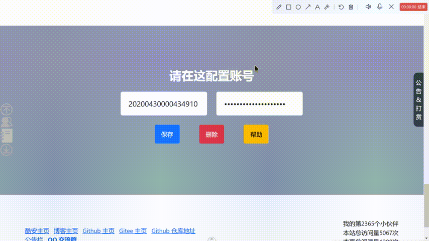
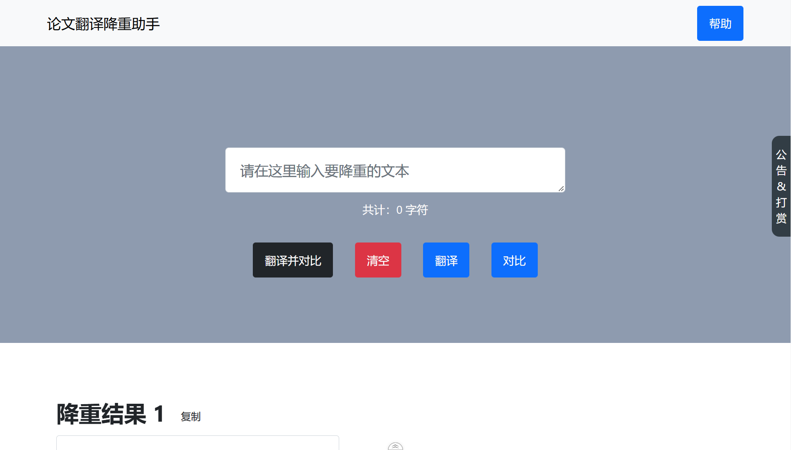
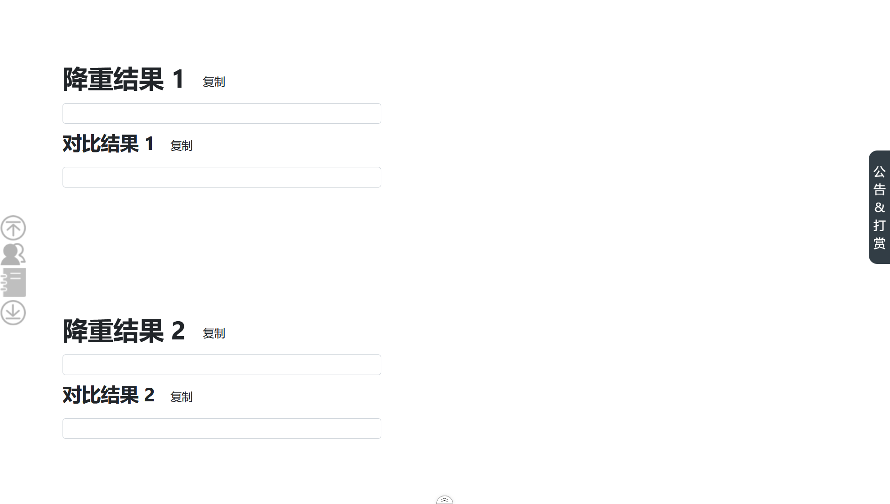
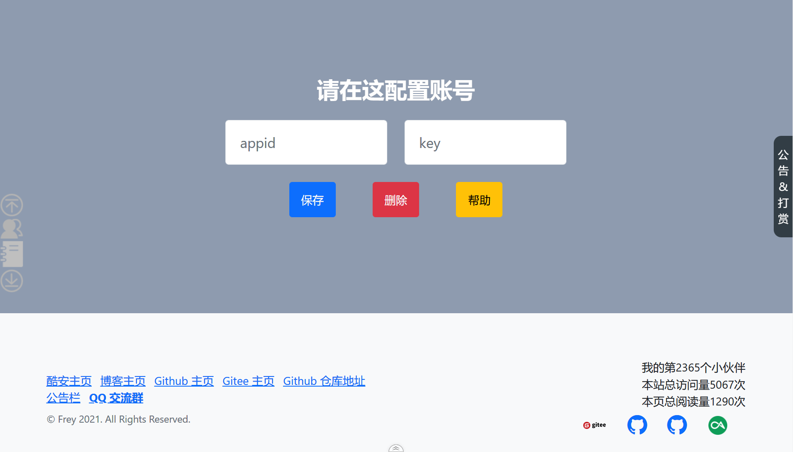
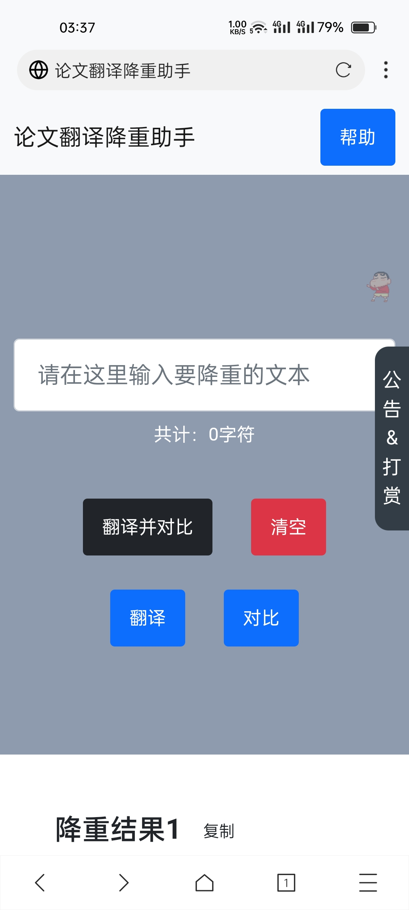
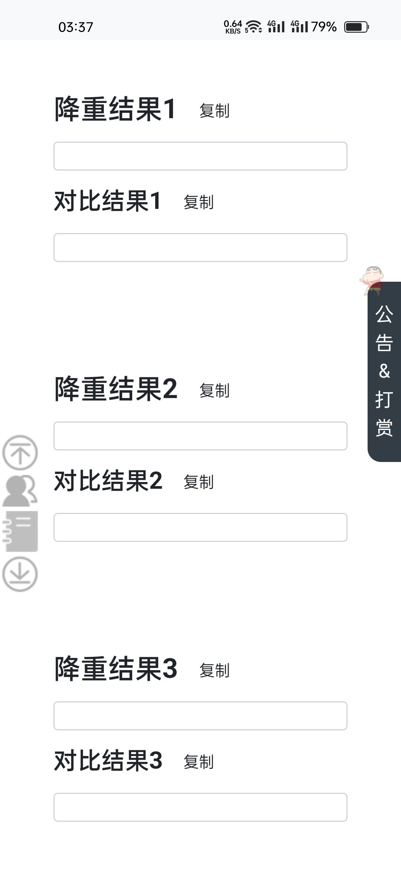
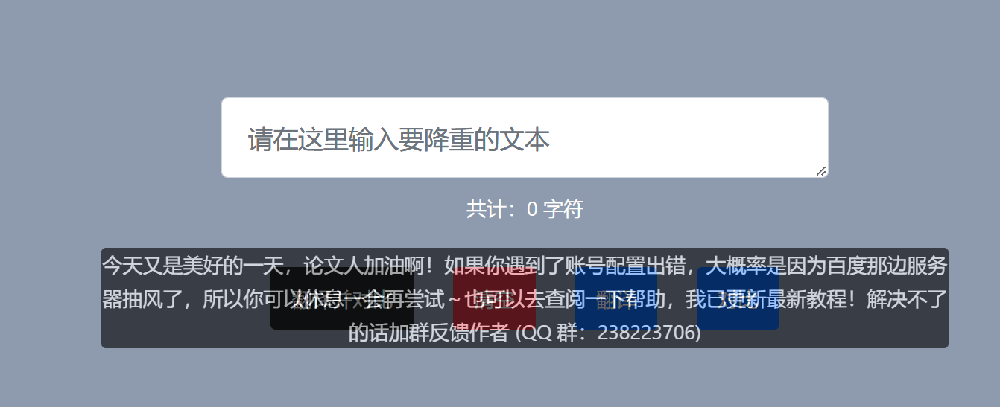
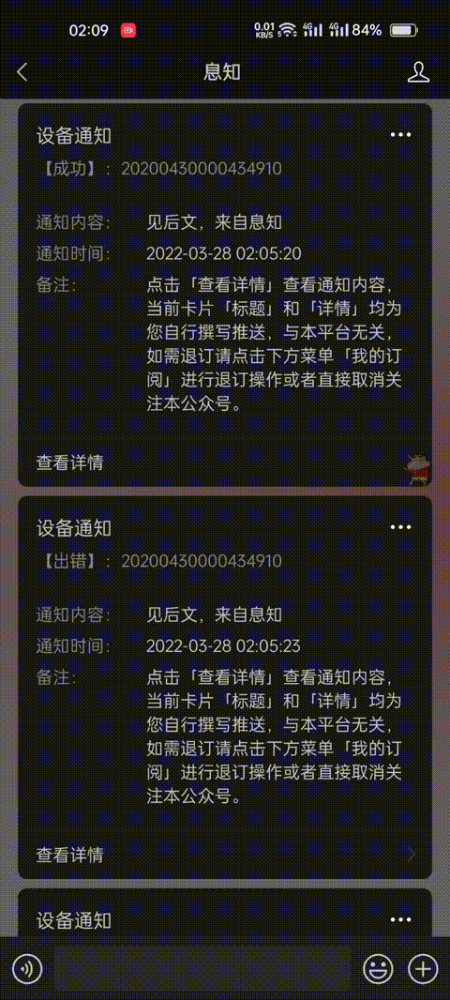
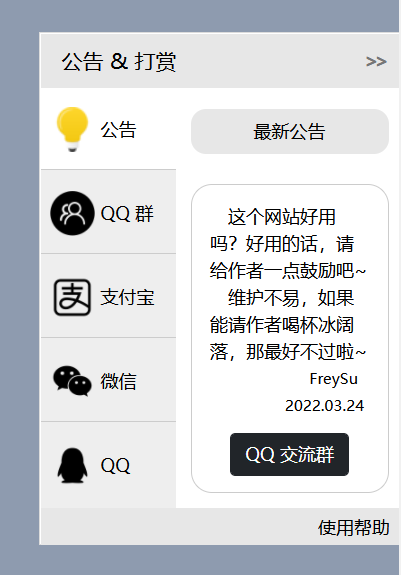

<div align="center">
    <h1>论文翻译降重助手(MyTranslator)</h1>
    <div>
        <a href="https://getbootstrap.com">
            
        </a>
        <a href="https://jquery.com/">
            
        </a>
                <a href="https://api.fanyi.baidu.com/">
            
        </a>
    </div>
    <div>
        <a href="https://github.com/freysu/MyTranslator">
            
        </a>
        <a href="https://github.com/freysu/MyTranslator">
            
        </a>
        <a href="https://github.com/freysu/MyTranslator">
            
        </a>
    </div>
</div>

---

## 项目介绍

- 项目概况
  **这是一个用于帮助毕业生写论文时提高降重效率的网站**

  由 `Github Pages` 部署的基于`百度翻译 API` 的网站，以提供翻译降重、文本对比等功能

- 项目演示地址：  
   _[https://freysu.github.io/MyTranslator](https://freysu.github.io/MyTranslator)_

- 项目演示动图：  
   

- 项目仓库文件介绍

  ```
  MyTransaltor
  │   index.html                      // 主页（入口文件）
  │   MyTransaltor.xmind              // DOM 节点树状图
  │   README.md                       // README.md
  │
  ├───assets                          // 存放静态资源的文件夹
  │
  ├───css
  │       myRewards.css               // 引入公告和打赏功能的 CSS 样式表
  │       styles.css                  // 主页 CSS 样式表
  │
  ├───docs                            // 文档文件夹
  │
  └───js
          bootstrap.bundle.min.js     // Bootstrap 相关
          bootstrap.min.js            // Bootstrap 相关
          busuanzi.pure.mini.js       // 引入的不蒜子的 JS 文件，用于统计网页浏览量、访客量的
          clipboard.min.js            // 引入的 Clipboard 的 JS 文件
          jquery.min.js               // jQuery 相关
          md5.js                      // MD5 加密
          tctip.min.js                // 引入公告和打赏功能的 JS 文件
  ```

## 快速开始

1. 克隆本项目到本地
   ```
   git clone https://github.com/freysu/MyTranslator
   ```
1. 预览页面

   - 可以选择安装搭建静态服务器的插件 live-server

   ```
   npm install live-server -g
   ```

   然后在浏览器中输入地址访问即可

   - 也可以选择直接打开`index.html`文件

1. 注册百度翻译 API
   关于这一步，就不占篇幅细说了，详情可见[论文翻译降重助手使用说明文档](https://freysu.github.io/2022/02/28/论文翻译降重助手使用说明文档)
1. 在论文翻译降重助手中填写百度翻译 API 的 APP ID 和密钥，然后输入要降重的内容点击翻译按钮即可

## 功能列表

- [x] 保存百度翻译 API 账号功能
  > 因为用户需要配置百度翻译 API，所以决定采用 **localStorage 本地存储**的策略来实现该功能，可以保存用户输入的 appid 和 key，也可以用来删除保存的内容。
- [x] 翻译功能、翻译出错重试功能

  > 通过 **jQuery** 的 **ajax** 方法封装了百度翻译 API，使用异步编程方式实现了发送多次请求从而返回多条翻译结果。

  > 部分用户会因心急多次点击而导致短时间内多次频繁请求，所以运用了**防抖**来优化性能。

  > 又因为不同版本的百度翻译 API 具有不同的 QPS（每秒请求量），普通版本的在多次请求时会超限从而导致无法返回翻译结果，为了解决此问题，添加了翻译重试功能来重新发送请求，在这方面很容易地陷入了回调地狱，这方面还在优化中。

  > 当获取到响应的数据时运用到了**正则表达式**来提取数据，并编写了文本对比功能来实现翻译内容与多条翻译结果的对比。

- [x] 复制功能
  > 引入了 GitHub @zenorocha 的 [clipboard.js](https://github.com/zenorocha/clipboard.js) 解决了复制功能。
- [x] 错误报警通知功能
  > 当用户在使用过程中出现翻译失败等功能时，将会发送微信通知。
- [x] 仿安卓 toast 提示功能
  > 封装了一个通过 **JavaScript Dom** 和 **CSS(3)** 样式来实现仿安卓 toast 提示功能函数，可以提示用户正在进行了哪些操作。
- [x] 统计字符功能

  > 因为百度翻译 API 的免费额度有限制，所以通过统计当前要降重的内容的字符来提示用户避免浪费。

  > 同时也通过统计降重结果的字符来提示修改后的字数。

- [x] PC 端和移动端页面布局适配
  > 因为需要考虑到用户将会使用到不同的浏览器环境。
- [x] 返回顶部功能
  > 通过 **CSS 的绝对定位**和 **window.scrollTo** 实现返回顶部功能并通过 **window.onscroll** 事件监听页面滚动条来实现隐藏返回顶部功能。
- [x] 公告与打赏功能
  > 在引入 GitHub @greedying 的[tctip](https://github.com/greedying/tctip)的基础上进行了修改。通过缩放解决了默认字体大小 12px 的问题，优化了公告栏的显示。另外，也优化了打赏二维码布局。
- [ ] ~~免申请百度翻译 API 试用三分钟功能~~
  > 通过验证密钥和构造 localStorage 存储的时效性来调用我本人的百度翻译 API 来实现，不过部署后发现浏览器兼容出了点问题，所以先暂时搁置，未来将会优化上线。

## 不足之处

- 布局方面还有待改进
- 进一步完善免申请百度翻译 API 试用三分钟功能
- 本次项目出现了回调地狱还有待优化
- 本次项目使用到的技术栈有点过时，所以我将会结合 Vue2、Axios、Element UI 来重构本项目

## 预览截图

- PC 端页面
  
  
  
- 移动端页面
  
  
  
- 仿 toast 提示功能
  
- 错误报警通知功能
  
- 公告与打赏功能
  

## 常见问题 QA：

1. Q：如果出现**配置账号出错**的情况
   A：请先检查**通用翻译服务**的开通情况，如果开通了再检查是否填错**百度翻译 API 的 `key` 和 `appid` **，确认无误后还是出现该情况请休息一会等会再重试，可能百度翻译 API 的服务器出了点小问题。
2. Q：如果出现 **翻译的时候出现很多翻译结果不出来(比如 6 个结果里只出来 1 个或 2 个)** 的情况

   A：**请留意一下自己申请的 api 是哪一个版本。** **标准版可能会发生以上情况。高级版大概率是不会的。**
   _实名认证之后可以免费申请高级版。_

3. Q：如果出现**配置账号正确但不出翻译结果**的情况
   A：请检查是否填写了**服务器地址**。


## 更新日志

- Commits on Mar 27, 2022

  1. 优化提示！
  2. 紧急修复了字符统计 bug；
  3. 优化了提示。

- Commits on Mar 26, 2022

  1. 修改细节
  2. 新增了统计字符功能
  3. 优化了布局
  4. 优化了若干细节

- Commits on Mar 24, 2022

  1. 优化网站加载速度
  2. 替换 QQ 收款码
  3. 替换 QQ 群二维码
  4. 取消锚点跳转

- Commits on Mar 23, 2022

  1. 用户鉴权
  2. 修改使用帮助
  3. 优化了提醒

- Commits on Mar 22, 2022

  1. 优化提示

- Commits on Mar 21, 2022

  1. 修复 BUG
  2. 紧急修复保存功能
  3. 推出了免申请 API 试用功能
  4. 优化了性能和错误提醒

- Commits on Mar 20, 2022

  1. 更新了免申请 API 试用功能
  2. 优化了网页性能，访问快了 10s
  3. 更新了评价和赞助渠道

- Commits on Mar 5, 2022

  1. 添加了翻译出错重试功能
  2. 添加公共栏和用户反馈功能
  3. 优化了布局等

- Commits on Mar 4, 2022

  1. 添加返回顶部等功能
  2. 优化细节

- Commits on Mar 1, 2022
  1. 优化请求链接地址
  2. 基于百度翻译 API 的论文翻译降重助手 v1.0
  3. index.html

freysu committed 27 days ago
